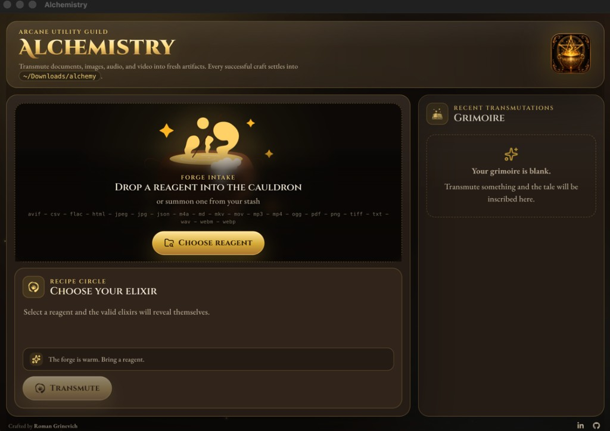

<p align="center">
  
</p>

<h1 align="center">Alchemistry</h1>

<p align="center"><em>A spellbook-themed desktop file converter — drop in a reagent, choose an elixir, and transmute your documents, images, audio, and video into fresh artifacts.</em></p>

<p align="center">
  
  
  
  
  
  
</p>

---

## Overview

**Alchemistry** is a cross-format file converter for macOS, dressed up as an alchemist's workbench. Bring a file (a _reagent_), and the app reveals only the output formats that conversion can actually produce (the _elixirs_). Pick one, hit **Transmute**, and the finished _artifact_ appears in `~/Downloads/alchemy`.

It runs **completely offline** — the image, audio, and video engines (`sharp` and a bundled copy of FFmpeg) ship inside the app, so your files never leave your machine.

<p align="center">
  
</p>

## Features

- **Drag & drop or browse** any supported file into the cauldron.
- **Smart format suggestions** — outputs are derived from a conversion matrix, so impossible conversions are never offered.
- **One tidy destination** — every craft lands in `~/Downloads/alchemy` (auto-created), with collision-safe naming.
- **The Grimoire** — a persistent history of your recent transmutations; open an artifact or reveal it in Finder in one click.
- **Private by design** — no network calls, no uploads, no telemetry.
- **A UI worth opening** — animated Lottie cauldron, ambient particles, an arcane loader, and a themed Cinzel + EB Garamond typeface pairing.

## Supported transmutations

| Family | Source | Transmutes into |
| --- | --- | --- |
| Image | `png` | `jpg`, `webp`, `avif`, `tiff` |
| Image | `jpg` / `jpeg` | `png`, `webp`, `avif`, `tiff` |
| Image | `webp` | `png`, `jpg`, `avif`, `tiff` |
| Image | `avif` | `png`, `jpg`, `webp` |
| Image | `tiff` | `png`, `jpg`, `webp` |
| Video | `mp4` | `webm`, `mov`, `mkv` &nbsp;·&nbsp; audio: `mp3`, `wav`, `m4a` |
| Video | `mov` | `mp4`, `webm`, `mkv` &nbsp;·&nbsp; audio: `mp3`, `wav`, `m4a` |
| Video | `mkv` | `mp4`, `webm` &nbsp;·&nbsp; audio: `mp3`, `wav`, `m4a` |
| Video | `webm` | `mp4`, `mkv` &nbsp;·&nbsp; audio: `mp3`, `wav`, `m4a` |
| Audio | `mp3` | `wav`, `m4a`, `flac`, `ogg` |
| Audio | `wav` | `mp3`, `m4a`, `flac`, `ogg` |
| Audio | `m4a` | `mp3`, `wav`, `flac`, `ogg` |
| Audio | `flac` | `mp3`, `wav`, `m4a`, `ogg` |
| Audio | `ogg` | `mp3`, `wav`, `m4a`, `flac` |
| Document | `txt` | `md`, `html` |
| Document | `md` | `html`, `txt` |
| Document | `html` | `txt` |
| Document | `csv` | `json`, `txt` |
| Document | `json` | `txt`, `html` |
| Document | `pdf` | `txt` &nbsp;(text extraction) |

> Video reagents can be distilled down to audio-only artifacts, but conversions never flow "uphill" (e.g. audio can't become video).

## Where do my files go?

- **Artifacts:** `~/Downloads/alchemy`. The folder is created on first use. If a name already exists, a numbered suffix is added (`report.txt` → `report 2.txt`).
- **History:** the Grimoire remembers your most recent **24** conversions in `grimoire.json` inside Electron's per-user `userData` directory, so it survives restarts.

## Tech stack

- **[Electron](https://www.electronjs.org/)** + **[electron-vite](https://electron-vite.org/)** — desktop shell & build pipeline
- **[React 19](https://react.dev/)** + **[TypeScript](https://www.typescriptlang.org/)** — renderer UI
- **[Vite 7](https://vite.dev/)** — bundling & HMR
- **[sharp](https://sharp.pixelplumbing.com/)** — image conversion
- **[ffmpeg-static](https://github.com/eugeneware/ffmpeg-static)** — bundled FFmpeg for audio/video
- **[marked](https://marked.js.org/)** (Markdown → HTML) & **[pdf-parse](https://www.npmjs.com/package/pdf-parse)** (PDF → text)
- **[motion](https://motion.dev/)**, **[lottie-web](https://github.com/airbnb/lottie-web)**, **[react-icons](https://react-icons.github.io/react-icons/)**, **[lucide-react](https://lucide.dev/)** — motion & iconography
- **[Fontsource](https://fontsource.org/)** — Cinzel, Cinzel Decorative & EB Garamond

## Getting started

**Prerequisites:** [Node.js](https://nodejs.org/) 20+ and npm. (Packaging a `.dmg` requires macOS.)

```bash
# install dependencies
npm install

# launch the desktop app with hot reload
npm run dev
```

The image/audio/video engines bundle their own native binaries, so there's no need to install FFmpeg or anything else system-wide.

## Build a macOS app

```bash
npm run build:mac
```

This compiles the app and packages an installer at `dist/Alchemistry-<version>-<arch>.dmg`.

The bundle is **ad-hoc signed** (no paid Apple Developer ID), which is perfectly fine for personal use. Because it isn't notarized, Gatekeeper will warn on first launch. To open it, either:

- Right-click the app → **Open** → **Open**, or
- after dragging it to **Applications**, clear the quarantine flag:

```bash
xattr -dr com.apple.quarantine /Applications/Alchemistry.app
```

## Scripts

| Script | What it does |
| --- | --- |
| `npm run dev` | Launch the app in development with hot reload |
| `npm run build` | Type-check, then build the main, preload, and renderer bundles |
| `npm run build:mac` | Build and package a macOS `.dmg` into `dist/` |
| `npm run preview` | Preview the production build |
| `npm run lint` | Run ESLint |
| `npm run typecheck` | Type-check without emitting |
| `npm test` | Run the Vitest suite (conversion-matrix tests) |

## Project structure

```text
Alchemistry/
├─ electron/                # Electron main process (Node side)
│  ├─ main.ts               # window creation, IPC, conversion orchestration
│  ├─ preload.ts            # secure contextBridge API
│  ├─ converters/           # image · audio · video · document engines
│  └─ services/             # output paths, file inspection, grimoire history
├─ src/                     # React renderer (UI)
│  ├─ App.tsx
│  ├─ components/           # ForgeDropzone, GrimoirePanel, ArcaneLoader, …
│  ├─ shared/               # conversion matrix + shared types
│  └─ assets/               # icon, Lottie cauldron, …
├─ build/                   # icon.icns + afterPack signing hook
├─ docs/                    # README assets
├─ electron-builder.yml     # packaging configuration
└─ electron.vite.config.ts
```

## Credits

Crafted by **Roman Grinevich** — [LinkedIn](https://www.linkedin.com/in/roman-grinevich-03b13bab/) · [GitHub](https://github.com/rg1989)

## License

Released under the [MIT License](LICENSE) © 2026 Roman Grinevich.
